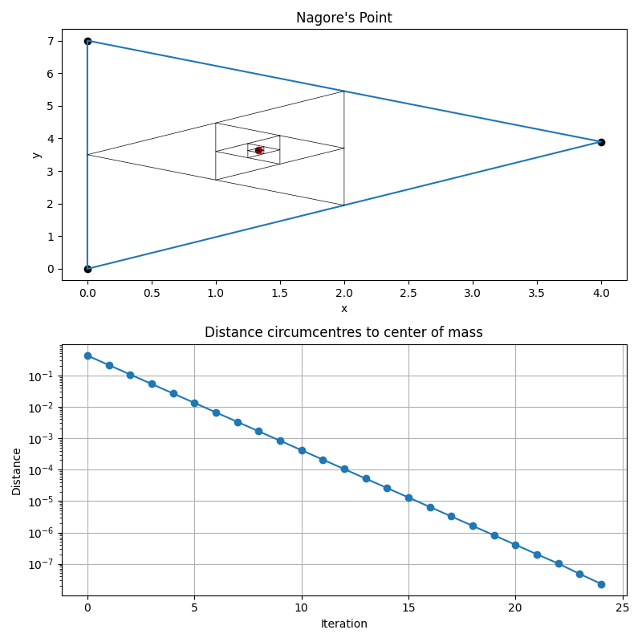

# Center of Mass by Triangle Convergence
Before I jumped to prove it, I wanted to validate the following hypothesis:

> Let there be three equal masses connected by massless rods forming a triangle. 
> These three masses have an associated center of mass G.
> Let there be a sequence of triangles constructed with the following rule:
> - The first triangle is the original triangle.
> - The second triangle is formed by connecting the three midpoints of the original triangle.
> - The third triangle is formed by connecting the three midpoints of the previous triangle.
> - And so on.
>
> The theorem states that the sequence of triangles converges to a point, which is the center of mass G.

